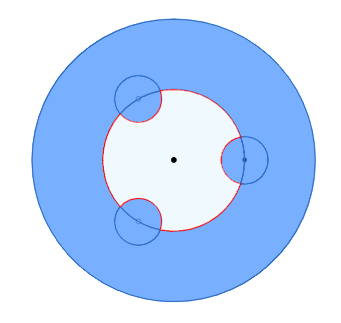

# Pitch-3d-Printed-Tapped-Holes
Functional 3d printed tapped holes with no extra hardware or modification to print. 

# Design Principal
3d printed holes tend to come out slightly undersized. By creating a hole with small extrusions to the tapped diameter, there is space for the plastic to be cut into as the bolt is threaded. This design removes the need for threaded inserts, or heated bolts to create threads

# Design Principal
  - Create a clearance hole for the given bolt size
  - Create small circles on the clearance circle such that the radius from hole center to the new circle edge is the tapped radius
  - 3 circles creates a strong fit takes longer to screw in each bolt
  - 2 circles creates an adequate fit, but is less tight than with 3

